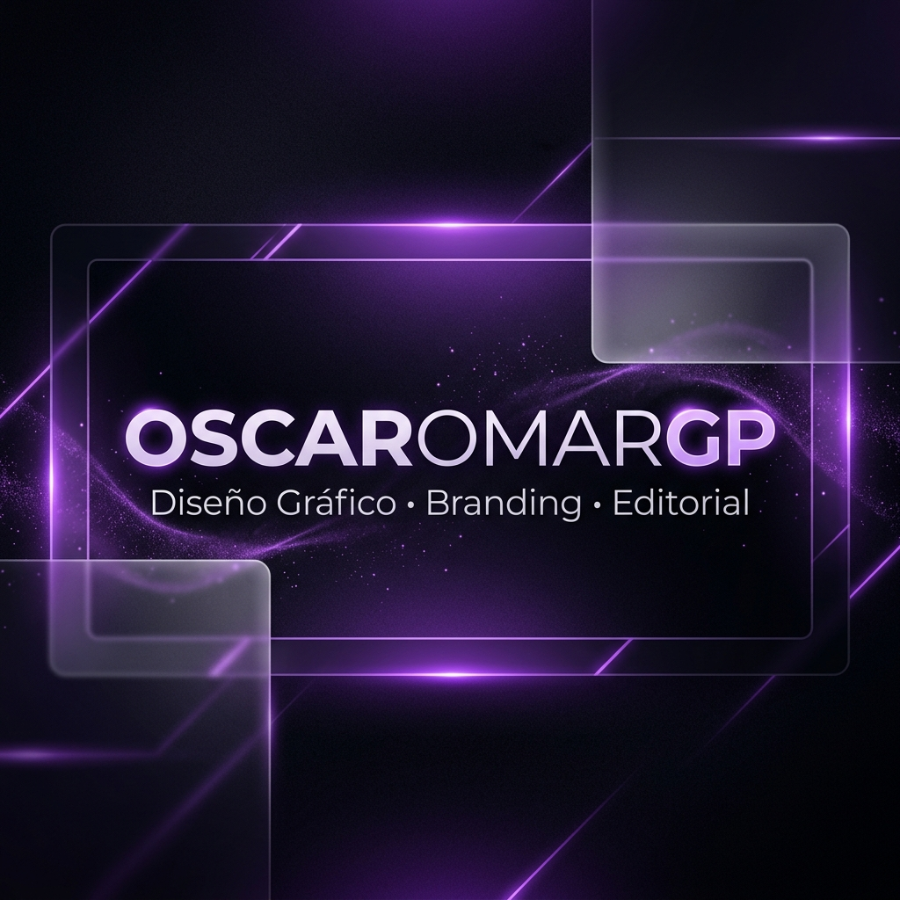
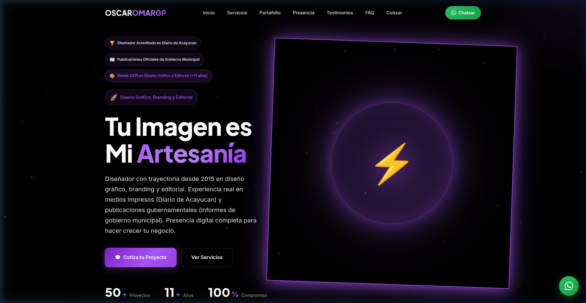
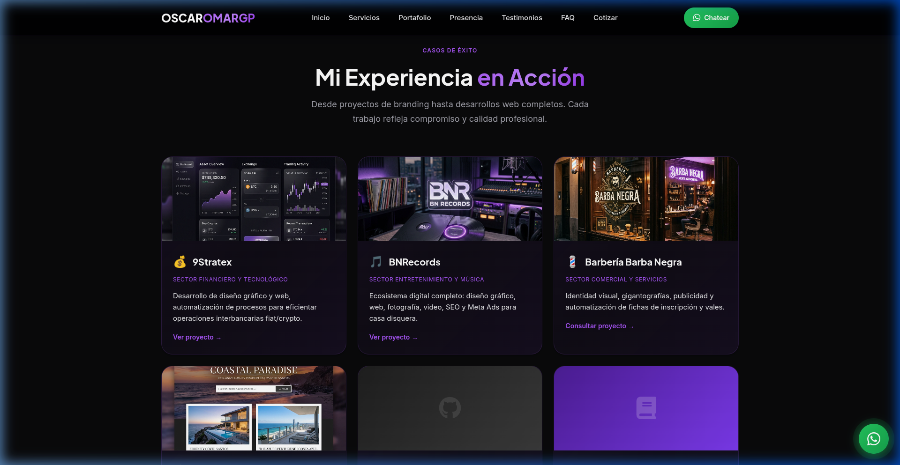
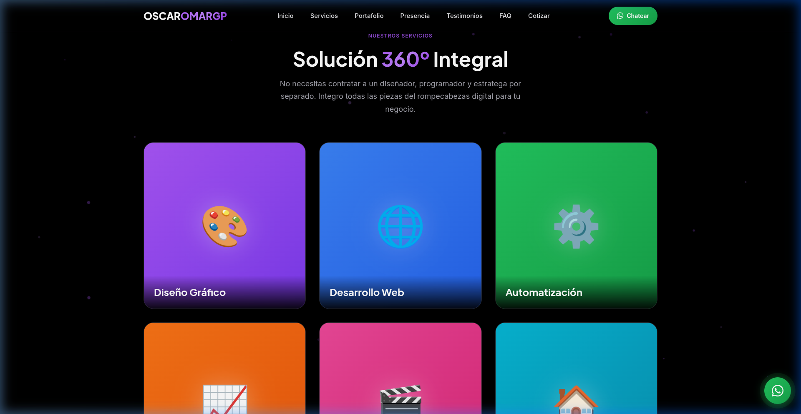
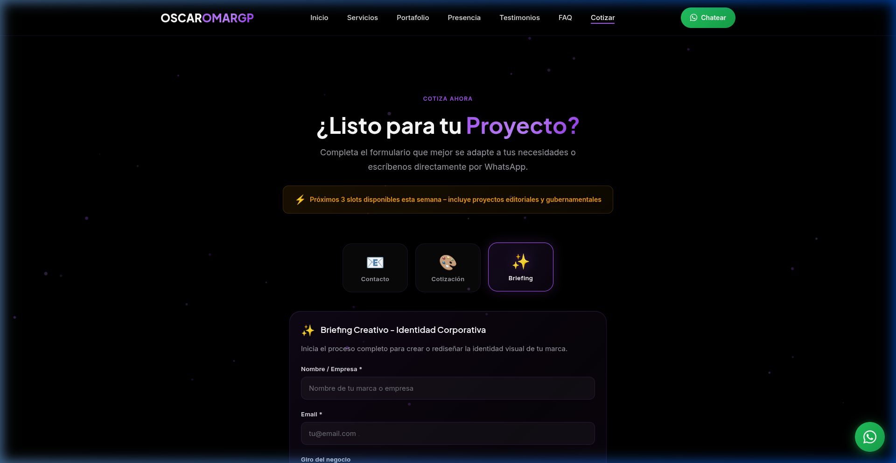

<p align="center">
  
</p>

<h1 align="center">OSCAROMARGP | Portafolio Profesional v4.3.0</h1>

<p align="center">
  <strong>Landing page premium de alta conversión diseñada para profesionales de diseño gráfico, branding y editorial.</strong>
</p>

<p align="center">
  
  
  
  
  
</p>

<p align="center">
  <a href="#-acerca-del-proyecto">Acerca</a> •
  <a href="#-características">Características</a> •
  <a href="#-demo">Demo</a> •
  <a href="#-comenzando">Comenzando</a> •
  <a href="#-uso">Uso</a> •
  <a href="#-apoya-este-proyecto">Donar</a> •
  <a href="#-contacto">Contacto</a>
</p>

---

## 📖 Acerca del Proyecto

<p align="center">
  
</p>

**OSCAROMARGP** es un ecosistema digital completo que transforma una simple landing page en una herramienta de cierre de ventas. Diseñado con una estética **Dark Luxury**, integra tecnologías modernas para ofrecer una experiencia fluida, rápida y profesional.

Este proyecto resuelve la necesidad de una presencia digital robusta para creativos, destacando trayectoria en medios impresos, publicaciones gubernamentales y diseño técnico.

### 🛠️ Construido Con

<p align="left">
  
  
  
  
</p>

---

## ✨ Características

| Característica | Descripción |
|---|---|
| ⚡ Alta Conversión | Sistema de formularios nativos organizados por pestañas (Tabs) con Web3Forms. |
| 🎨 Diseño Premium | Estética Glassmorphism con efectos de luz púrpura (#A855F7) y animaciones fluidas. |
| 📱 Responsivo | Tipografía fluida `clamp()` y layouts adaptables a cualquier dispositivo. |
| 🔍 SEO Avanzado | Meta tags completos, Open Graph y Schema.org JSON-LD para indexación profesional. |
| 🌍 Multilenguaje | Integración de widget de traducción con posicionamiento optimizado. |

---

## 🎬 Demo

<p align="center">
  
</p>

> [Visita el sitio web en vivo aquí](https://oscaromargp.github.io/Oscaromargp/) para experimentar las animaciones de zoom y el sistema de pestañas.

---

## 🚀 Comenzando

### Prerrequisitos

- Navegador web moderno (Chrome, Firefox, Safari, Edge).
- Conexión a internet para cargar fuentes de Google y Font Awesome.

### Instalación

1. Clona el repositorio
   ```sh
   git clone https://github.com/oscaromargp/Oscaromargp.git
   ```

2. Entra al directorio
   ```sh
   cd Oscaromargp
   ```

3. Abre el archivo principal
   ```sh
   xdg-open index.html  # En Linux
   # o simplemente arrastra index.html a tu navegador.
   ```

---

## 💡 Uso

### Sistema de Pestañas de Formulario
El proyecto implementa un sistema inteligente de formularios. Puedes cambiar entre ellos haciendo clic en los iconos:

```javascript
// Lógica de cambio de pestañas (script.js)
tabs.forEach(function(tab) {
    tab.addEventListener('click', function() {
        const formId = tab.getAttribute('data-form');
        // Activa el panel correspondiente con transiciones suaves
    });
});
```

### Capturas Adicionales

<p align="center">
  
  &nbsp;&nbsp;
  
</p>

---

## 🤝 Contribuyendo

¡Las contribuciones son bienvenidas!

1. Haz un fork del repositorio
2. Crea tu rama: `git checkout -b feature/mejora`
3. Haz commit: `git commit -m 'feat: agrega mejora'`
4. Push: `git push origin feature/mejora`
5. Abre un Pull Request

---

## 💖 Apoya este Proyecto

Si este proyecto te fue útil, considera hacer una contribución. Esto me ayuda a seguir creando herramientas de diseño y código abierto.

<p align="center">
  <strong>Donaciones en Criptomonedas — Red XRP</strong><br><br>
  
</p>

> Dirección XRP: `rBthUCndKy3Xbb19Ln4xkZeMwusX9NrYfj`

---

## 📄 Licencia

Distribuido bajo la licencia MIT. Consulta el archivo [LICENSE](LICENSE) para más información.

---

## 📬 Contacto

<p align="center">
  <strong>Oscar Omar Gómez Peña</strong>
</p>

<p align="center">
  <a href="https://oscaromargp.github.io/Oscaromargp/">
    
  </a>
  &nbsp;
  <a href="https://github.com/oscaromargp">
    
  </a>
</p>

<p align="center">
  <a href="https://github.com/oscaromargp/Oscaromargp">Ver Repositorio Oficial</a>
</p>

---

## 🙏 Agradecimientos

<p align="center">
  <br/>
  <em>
    "Porque Dios es el que en vosotros produce<br/>
    así el querer como el hacer,<br/>
    por su buena voluntad."
  </em>
  <br/>
  <strong>— Filipenses 2:13</strong>
  <br/><br/>
  Todo lo que aquí existe nació primero como un deseo en el corazón.<br/>
  Cada proyecto, cada línea, cada idea que toma forma —<br/>
  es un regalo de Aquel que nos dio tanto el sueño como la fuerza de alcanzarlo.<br/>
  <strong>A Dios, toda la gloria.</strong>
  <br/>
</p>

---

- [Shields.io](https://shields.io) — por los badges
- [Antigravity](https://antigravity.dev) — por la metodología de desarrollo
- **Diario de Acayucan** — por la trayectoria y créditos profesionales
