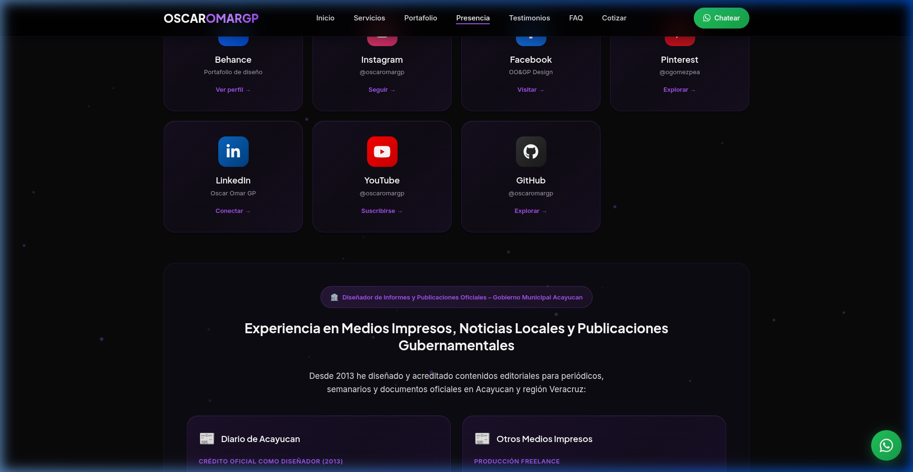

# 💎 OSCAROMARGP: Portafolio Premium v4.3.0

<div align="center">

[](https://oscaromargp.github.io/Oscaromargp/)
[](https://github.com/oscaromargp/Oscaromargp)
[](https://oscaromargp.github.io/Oscaromargp/)

**"Tu imagen es mi artesanía"**  
*Diseñador Gráfico, Branding y Editorial con trayectoria desde 2015.*

[Explorar Sitio Web Live →](https://oscaromargp.github.io/Oscaromargp/)

</div>

---

## 📸 Vista Previa (Screenshots)

<div align="center">

### 🚀 Hero Section - Impacto Visual Inmediato


### 🎨 Servicios de Diseño Integral (Flip Cards)


### 💼 Casos de Éxito & Portafolio Técnico


### 📧 Sistema de Formularios Inteligentes (Tabs)


</div>

---

## ✨ Características Principales

- 🎯 **Conversión Optimizada**: Sistema de formularios nativos (Web3Forms) organizados por pestañas para máxima claridad.
- 📱 **Mobile First**: Diseño 100% responsivo con tipografía fluida (`clamp()`) y navegación adaptativa.
- 🕯️ **Dark Luxury Aesthetic**: Interfaz elegante basada en púrpura (#A855F7) con efectos de glassmorphism y resplandor.
- ⚡ **Performance Ultra**: Construido con Vanilla JS, HTML5 y CSS3 puro para tiempos de carga instantáneos.
- 🔍 **SEO & Accessibility**: Estructura semántica, Schema.org JSON-LD para meta-datos profesionales y etiquetas ARIA.

---

## 🛠️ Stack Tecnológico

| Front-end | Herramientas & Backend |
| :--- | :--- |
|  |  |
|  |  |
|  |  |

---

## 📈 Trayectoria Profesional (2015 – 2026)

- **Diario de Acayucan**: Diseñador Acreditado con múltiples publicaciones impresas.
- **Gobierno Municipal**: Diseño de informes oficiales y publicaciones gubernamentales.
- **Identidad Corporativa**: Branding completo para empresas financieras, tecnológicas y de entretenimiento.



---

## 🚀 Instalación y Despliegue

```bash
# 1. Clonar el repositorio
git clone https://github.com/oscaromargp/Oscaromargp.git

# 2. Entrar al directorio
cd Oscaromargp

# 3. Abrir en tu navegador
# macOS: open index.html | Windows: start index.html | Linux: xdg-open index.html
```

---

## 📄 Licencia

Este proyecto está bajo la Licencia MIT.  
Hecho con ❤️ por **Oscar Omar Gómez Peña**.

---

<div align="center">

[Visita el sitio oficial: oscaromargp.github.io/Oscaromargp/](https://oscaromargp.github.io/Oscaromargp/)

</div>
